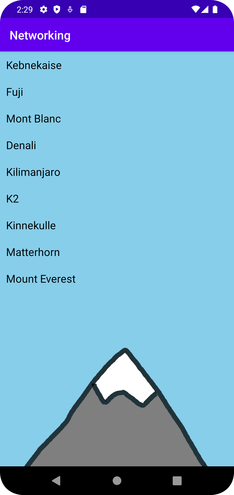

# Report

I felt it made sense to create the Mountain class first, so that's what I did. I took help from the 
documentation and also generated getters and setters within the class. Afterwards I created an ArrayList
which I filled with the values name, location and height. Following that, the next step I took was to
create a RecyclerView and a new layout resource file for the RecyclerView items. I also created
two new classes called RecyclerViewAdapter and RecyclerViewItem. These classes are necessary for a
RecyclerView to function, especially if there are more items than what the screen can contain, 
so it's scrollable. 
A for-loop was necessary to implement in order for the previously created ArrayList
to display all elements. At this point, the app was almost done, as pretty much the only remaining step
was to figure out a way to retrieve data from the JSON_URL that contains 3 additional elements. 
Even though I enabled internet for the app, the app crashes when attempting to get data from the url.
This, apparently, has something to do with the firewall in the lab computer. So, instead of retrieving
the data from the JSON_URL, I instead used the local file, called mountains.json located in assets.
The last thing I did was to add an ImageView and some colors to make the app look a bit better.


This is a portion of the onCreate() method where the ArrayList is located, as well as the for-loop
necessary to display the elements of both the ArrayList and the values from the JSON_FILE.
If I had more time on this assignment, I would have tried to display the location and height of the
mountains as well.
```
    @Override
    protected void onCreate(Bundle savedInstanceState) {
        super.onCreate(savedInstanceState);
        setContentView(R.layout.activity_main);

            ArrayList<Mountain> mountains = new ArrayList<>(Arrays.asList(
                    new Mountain("Kebnekaise", "Sweden", 2096),
                    new Mountain("Fuji", "Japan", 3776),
                    new Mountain("Mont Blanc", "Italy", 4809),
                    new Mountain("Denali", "USA", 6190),
                    new Mountain("Kilimanjaro", "Tanzania", 5895),
                    new Mountain("K2", "Pakistan", 8611)));

            items = new ArrayList<>();
            for (Mountain mountain : mountains) {
                items.add(new RecyclerViewItem(mountain.getName()));

            }
```


